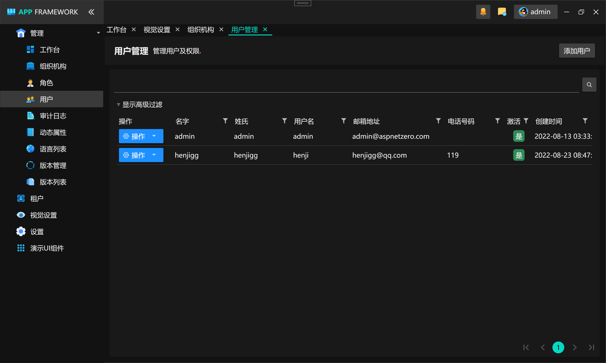
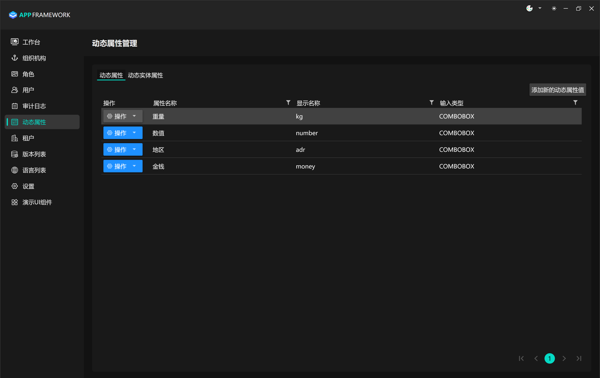
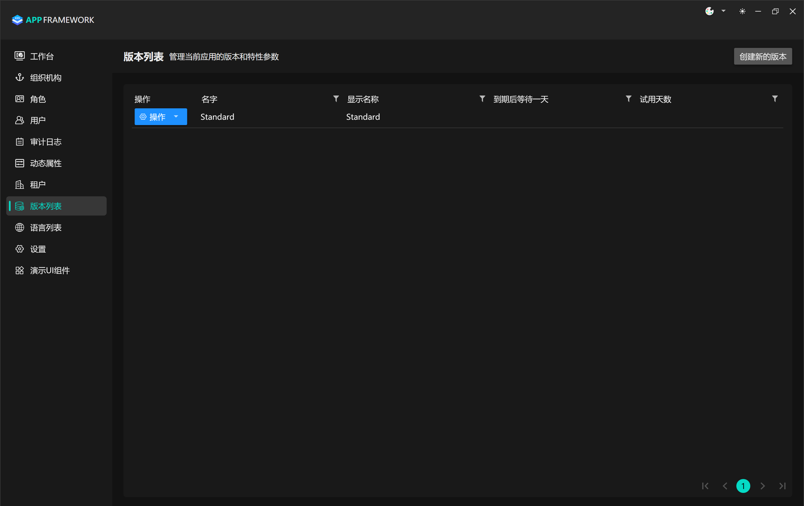
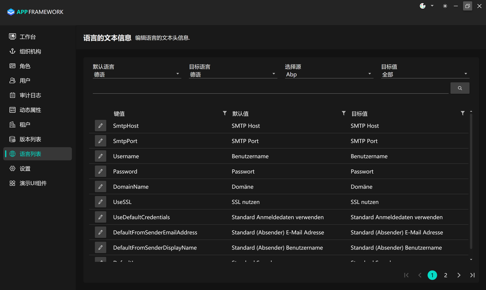
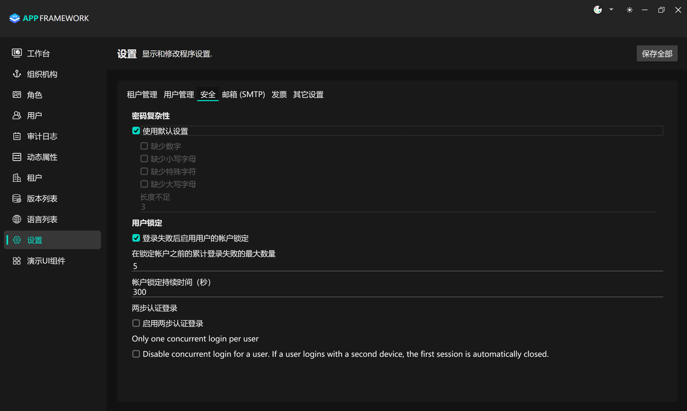
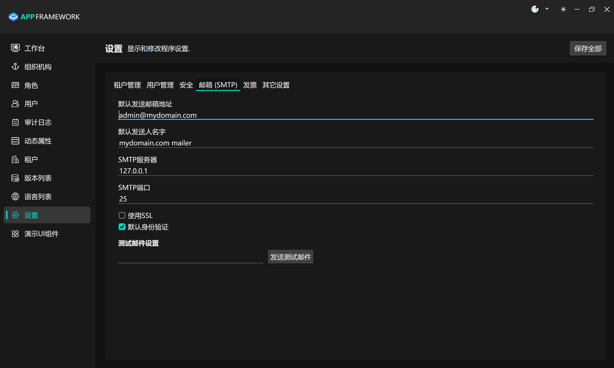
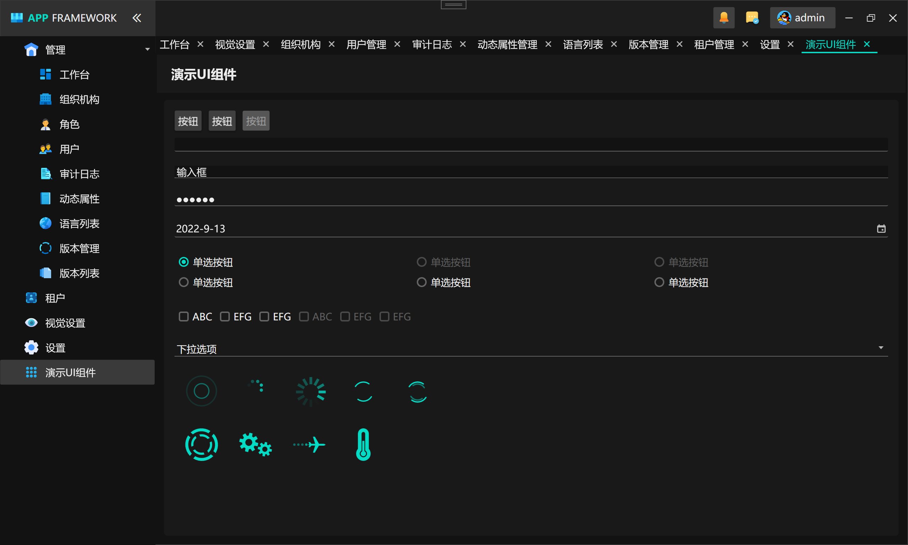
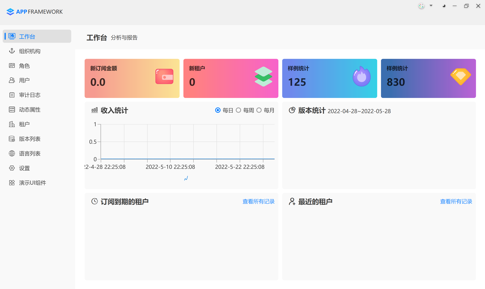
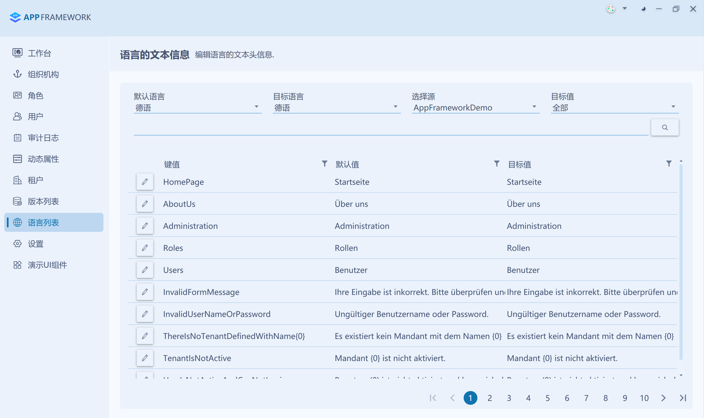
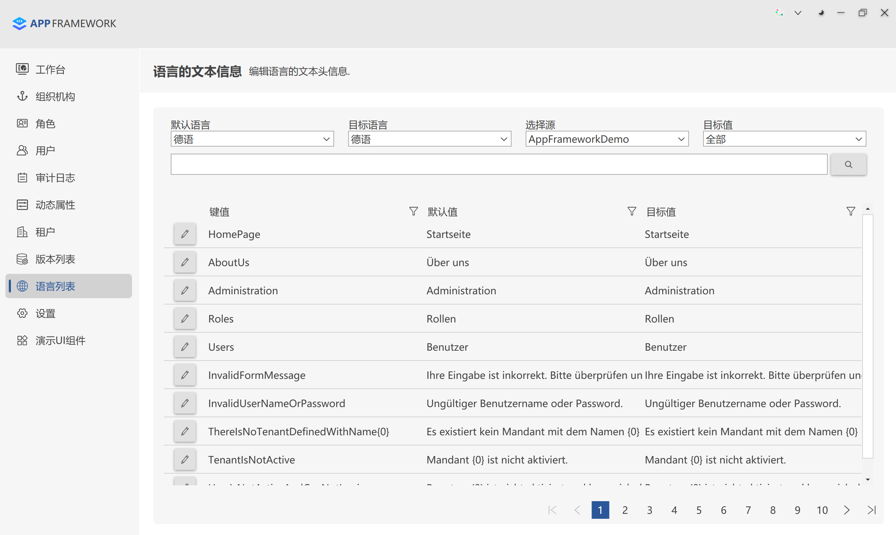

MAUI version of ABP framework   [Click Me]([HenJigg/maui-abp: MAUI cross-platform application based on ABP framework (github.com)](https://github.com/HenJigg/maui-abp))

## Introduction

This framework is fully developed based on the ABP commercial version framework, realizes the functions in the ABP commercial version, and provides WPF and Xamarin.Forms versions to achieve complete cross-platform application development.

The functions of this framework include the following: 

- User and role management
- organization
- authority management
- multi-tenancy
- Localized in multiple languages
- Authentication and Authorization
- Audit logging
- UI themes
- exception handling
- Data Dictionary
- system settings

## Project instruction

ABP officially does not officially provide a full version of the WPF framework, so this set of frameworks appeared to fill the gap in the market. If you are a developer using the ABP framework, then you can directly connect this set of systems to you without any effort. system business.

And in the ABP commercial version, the Xamarin.Forms framework provided is also very simple, so this framework also includes the complete Xamarin.Forms version.

## Project authorization

This repository does not contain the complete WPF and Xamarin.Forms code, but only contains part of the business code implementation, which cannot be compiled and run normally. If you are interested in related commercial licenses, you can take the initiative to contact the author for consultation, and please indicate your intention to add.

- QQ：779149549
- Email:  779149549@qq.com

**Special Note**: All source code for this framework is only $499

## Videos and Documentation

For the actual operation renderings, you can refer to the video: [WPF ABP Framework Demo]([WPF Development Framework Introduction (Domestic First Release)_bilibili_bilibili](https://www.bilibili.com/video/BV1Av4y1w7ds?spm_id_from =333.999.0.0))

The following shows the effect through some actual running screenshots, including the desktop (WPF) and mobile (Xamarin.Forms) renderings.

## Screenshot

#### WPF

- Login Page

- Home Page

- User Page

- Role Page

- Audit log

- dynamic properties

- multi-tenancy

- Version list

- Language list

- system settings

- System themes

#### Xamarin.Forms

- Login Page

- Home Page

- Menus

- organization

- Role Page

- User Page

- Audit log page

- Dynamic property page

- Tenant page

- Version management

- Language list

- theme switch

